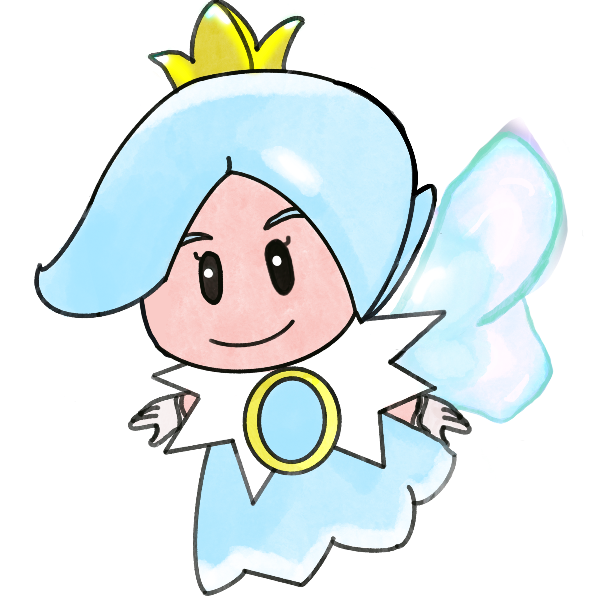

<h1>
   Tetris Multiplayer Frontend
</h1>

A project with [Whazami](https://github.com/whazami)

This repository contains the **frontend** of the Tetris Multiplayer project. The application allows users to play Tetris solo or with friends in multiplayer mode. Themes change randomly to enhance the gaming experience.

---
<h2>
   
  Features
</h2>

- **Single Player Mode**: Accessible directly via the browser.
- **Multiplayer Mode**: Create and join rooms with custom unique usernames.
- **Dynamic Themes**: The Tetris game changes its appearance randomly.
- **Real-Time Communication**: Powered by sockets for seamless interactions.
- **Bonus for Tetris Players**: Includes support for all advanced moves, including T-Spins, O-Spins, and other spin techniques, adding depth and strategy to the gameplay.
<div align="center">
  <video src="[screenshots/TspinAndPenalty.mp4](https://github.com/olelong/red-tetris-frontend/blob/main/screenshots/TspinAndPenalty.mp4)">
    Your browser does not support videos 
  </video>
</div>
  
- **Special Spin Penalties**: When a player performs a spin in multiplayer mode, a special penalty is applied to other players, temporarily increasing the gravity and making their pieces fall faster.
- **Line Clear Penalties**: In multiplayer mode, clearing more than one line at a time sends penalties to other players. The number of lines sent is equal to the number cleared minus one, and these penalty lines are indestructible.
<div align="center">
 
</div>
  
- **Spectator View**: Players can view the "ghost pieces" or specters of other players' boards in multiplayer mode.
- **Room Master System**: The first player to connect to a room becomes the master and is the only one who can start the game. If the master leaves the room, another player is automatically assigned as the new master.
- **Joining Ongoing Games**: If a player joins a game already in progress, they will need to refresh the page after the game ends to rejoin the room.

---
<h2>
   
  Prerequisites
</h2>

To run this frontend, you also need the [backend repository](https://github.com/olelong/red-tetris-backend). Make sure to clone and set it up before proceeding.

---
<h2>
    
  Setup Instructions
</h2>

### Step 1: Clone and Set Up the Backend
1. Clone the backend repository:
   ```bash
   git clone git@github.com:olelong/red-tetris-backend.git
   cd red-tetris-backend
   ```
2. Install dependencies:
   ```bash
   npm install
   ```
3. Start the backend server:
   ```bash
   npm run start
   ```

### Step 2: Clone and Set Up the Frontend
1. Clone this repository:
    ```bash
   git clone git@github.com:olelong/red-tetris-frontend.git
   cd red-tetris-frontend
   ```
2. Install dependencies:
   ```bash
   npm install
   ```
3. Start the frontend server:
   ```bash
   npm run start
   Y // Would you like to run the app on another port instead? › (Y/n)
   ```

The frontend will be accessible at:
- **http://localhost:3001** (when run standalone)
- **http://localhost:3000** (if served statically by the backend).

---
<h2>
   
  How to Play
</h2>

### Single Player Mode
- Open the following URL:
  ```
  http://localhost:3000
  ```
  Or:
  ```
  http://localhost:3001
  ```

### Multiplayer Mode
- Use the following format to join a room:
  ```
  http://localhost:3000/{roomName}/{userName}
  ```
  Replace `{roomName}` with the name of the room and `{userName}` with your desired username.

---
<h2>
   
 Available Commands
</h2>

### Development Commands
- **Install dependencies**:
  ```bash
  npm install
  ```
- **Start the development server**:
  ```bash
  npm run start
  ```

### Build Commands
- **Build for production**:
  ```bash
  npm run build
  ```

### Testing Commands
- **Run tests**:
  ```bash
  npm run test
  ```
- **View test coverage**:
  ```bash
  npm run coverage
  ```
---
<h2>
   
 Technologies Used
</h2>

## Technologies Used
- **Frontend**: ReactJS, Redux
- **Backend Communication**: Sockets (no database or API involved).

---

Enjoy the game!

